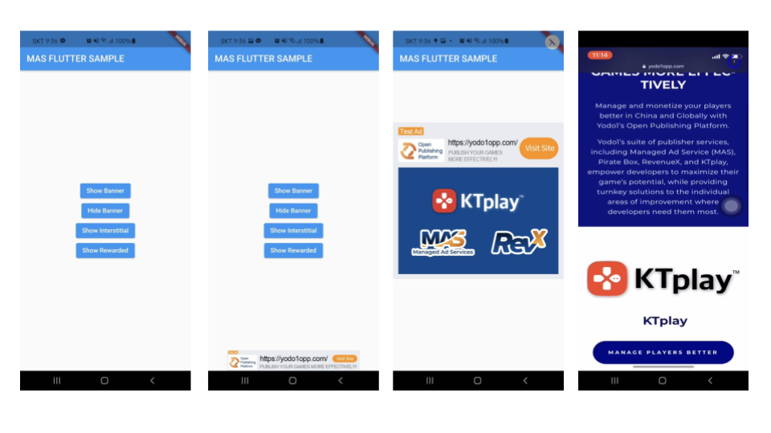
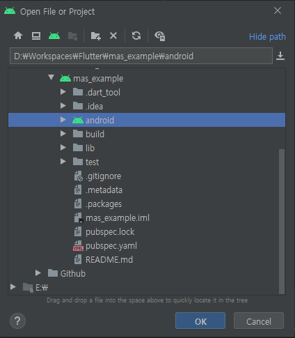

# Yodo1 MAS Example Project(Flutter)
## Example Test Envrionment
CPU: AMD Ryzen 7 3800X  
RAM: 32GB  
GPU: RTX 3060 Ti 
FLUTTER: 2.0.5  
MAS: 4.0.5  
ANDROID STUDIO: 4.1.3  
MOBILE: SAMSUNG GALAXY S10+  

## Example Showcase

## CAUTION
This example was created as an example of using MAS.  
In fact, there are many more things to consider in order to launch an app with Flutter.  

And Google uses kotlin as Flutter's native Android language.
So, this example is also done in the Kotlin language.

## How to run the example
### Create a new Flutter project
> flutter new mas-example

### Proceed with the MAS Android integration process.
Android Studio manages Flutter and Kotlin projects separately.  
That's why when you create a Flutter project, you have both iOS and web inside.  
Therefore, it is recommended to open the Android project with [File]-[Open] when proceeding with the MAS Android integration process.  



Now proceed with the [MAS Integration Document](https://support.yodo1.com/hc/en-us/articles/1500002038322).

### Modify main.dart code
The structure of the code is very simple.  
Flutter can call methods implemented in Kotlin through MethodChannel.  
Create 4 buttons and call the Kotlin method when pressed.
``` dart
import 'package:flutter/material.dart';
import 'package:flutter/services.dart';

void main() {
  runApp(MyApp());
}

class MyApp extends StatelessWidget {
  @override
  Widget build(BuildContext context) {
    return MaterialApp(
      title: 'Flutter Demo',
      theme: ThemeData(
        primarySwatch: Colors.blue,
      ),
      home: SamplePage(),
    );
  }
}

class SamplePage extends StatefulWidget {
  SamplePage() : super();

  @override
  _SamplePageState createState() => _SamplePageState();
}

class _SamplePageState extends State<SamplePage> {
  static const platform = const MethodChannel('com.sample.mas');

  @override
  Widget build(BuildContext context) {
    return Scaffold(
      appBar: AppBar(
        title: Text("MAS FLUTTER SAMPLE"),
      ),
      body: Center(
        child: Column(
          mainAxisAlignment: MainAxisAlignment.center,
          children: <Widget>[
            ElevatedButton(
              onPressed: () {
                platform.invokeMethod('showBannerAd');
              },
              child: Text("Show Banner"),
            ),
            ElevatedButton(
              onPressed: () {
                platform.invokeMethod('dismissBannerAd');
              },
              child: Text("Hide Banner"),
            ),
            ElevatedButton(
              onPressed: () {
                platform.invokeMethod('showInterstitialAd');
              },
              child: Text("Show Interstitial"),
            ),
            ElevatedButton(
              onPressed: () {
                platform.invokeMethod('showRewardedAd');
              },
              child: Text("Show Rewarded"),
            ),
          ],
        ),
      ),
    );
  }
}

```

### Modify MainActiviy.kt
Edit MainActivity.kt.  
It looks long, but it's actually very simple code.  
All you need to do is register MethodChannel for Flutter and call it in some cases.
``` kotlin
package com.example.mas_example

import android.app.Activity
import android.os.Bundle
import com.yodo1.mas.Yodo1Mas
import com.yodo1.mas.Yodo1Mas.*
import com.yodo1.mas.error.Yodo1MasError
import com.yodo1.mas.event.Yodo1MasAdEvent
import io.flutter.embedding.android.FlutterActivity
import io.flutter.embedding.engine.FlutterEngine
import io.flutter.plugin.common.MethodChannel
import io.flutter.plugins.GeneratedPluginRegistrant


class MainActivity: FlutterActivity() {
    private var CHANNEL:String = "com.sample.mas"

    override fun onCreate(savedInstanceState: Bundle?) {
        super.onCreate(savedInstanceState)

        ////////////////////////////////////////////////////////////////
        // YODO1MAS INITIALIZE
        ////////////////////////////////////////////////////////////////
        Yodo1Mas.getInstance().init(this, "qc2CstjcG5p", object : Yodo1Mas.InitListener {
            override fun onMasInitSuccessful() {
                /* BANNER */
                Yodo1Mas.getInstance().setBannerListener(object : Yodo1Mas.BannerListener() {
                    override fun onAdOpened(event: Yodo1MasAdEvent) {}
                    override fun onAdError(event: Yodo1MasAdEvent, error: Yodo1MasError) {}
                    override fun onAdClosed(event: Yodo1MasAdEvent) {}
                })
                /* INTERSTITIAL */
                Yodo1Mas.getInstance().setInterstitialListener(object : Yodo1Mas.InterstitialListener() {
                    override fun onAdOpened(event: Yodo1MasAdEvent) {}
                    override fun onAdError(event: Yodo1MasAdEvent, error: Yodo1MasError) {}
                    override fun onAdClosed(event: Yodo1MasAdEvent) {}
                })
                /* REWARDED */
                Yodo1Mas.getInstance().setRewardListener(object : RewardListener() {
                    override fun onAdOpened(event: Yodo1MasAdEvent) {}
                    override fun onAdvertRewardEarned(event: Yodo1MasAdEvent) {}
                    override fun onAdError(event: Yodo1MasAdEvent, error: Yodo1MasError) {}
                    override fun onAdClosed(event: Yodo1MasAdEvent) {}
                })

            }

            override fun onMasInitFailed(error: Yodo1MasError) {}
        })

        ////////////////////////////////////////////////////////////////
        // YODO1MAS METHODS FOR USING IN FLUTTER
        ////////////////////////////////////////////////////////////////

        /* LOAD */
        fun isRewardAdLoaded():Boolean
        {
            return Yodo1Mas.getInstance().isRewardedAdLoaded;
        }

        fun isInterstitialAdLoaded():Boolean
        {
            return Yodo1Mas.getInstance().isInterstitialAdLoaded;
        }

        fun isBannerAdLoaded():Boolean
        {
            return Yodo1Mas.getInstance().isBannerAdLoaded;
        }

        /* SHOW */
        fun showRewardedAd()
        {
            (context as Activity).runOnUiThread { Yodo1Mas.getInstance().showRewardedAd((context as Activity)) }
        }

        fun showInterstitialAd()
        {
            (context as Activity).runOnUiThread { Yodo1Mas.getInstance().showInterstitialAd((context as Activity)) }
        }

        fun showBannerAd(align: Int, offsetX: Int, offsetY: Int)
        {
            (context as Activity).runOnUiThread { Yodo1Mas.getInstance().showBannerAd((context as Activity), align, offsetX, offsetY) }
        }

        /* DISMISS */
        fun dismissBannerAd()
        {
            (context as Activity).runOnUiThread { Yodo1Mas.getInstance().dismissBannerAd() }
        }

        ////////////////////////////////////////////////////////////////
        // FLUTTER CHANNEL
        ////////////////////////////////////////////////////////////////
        GeneratedPluginRegistrant.registerWith(FlutterEngine(this))
        MethodChannel(flutterEngine?.dartExecutor?.binaryMessenger, CHANNEL).setMethodCallHandler { call, result ->
            when{
                call.method.equals("isRewardAdLoaded") -> { result.success(isRewardAdLoaded()) }
                call.method.equals("isInterstitialAdLoaded") -> { result.success(isInterstitialAdLoaded()) }
                call.method.equals("isBannerAdLoaded") -> { result.success(isBannerAdLoaded()) }
                call.method.equals("showRewardedAd") -> { result.success(showRewardedAd()) }
                call.method.equals("showInterstitialAd") -> { result.success(showInterstitialAd()) }
                call.method.equals("showBannerAd") -> { result.success(showBannerAd(48,0,0)) }
                call.method.equals("dismissBannerAd") -> { result.success(dismissBannerAd()) }

            }
        }
    }
}

```
What to look out for here is the FLUTTER CHANNEL.  
``` Kotlin
////////////////////////////////////////////////////////////////
// FLUTTER CHANNEL
////////////////////////////////////////////////////////////////
GeneratedPluginRegistrant.registerWith(FlutterEngine(this))
MethodChannel(flutterEngine?.dartExecutor?.binaryMessenger, CHANNEL).setMethodCallHandler { call, result ->
    when{
        call.method.equals("isRewardAdLoaded") -> { result.success(isRewardAdLoaded()) }
        call.method.equals("isInterstitialAdLoaded") -> { result.success(isInterstitialAdLoaded()) }
        call.method.equals("isBannerAdLoaded") -> { result.success(isBannerAdLoaded()) }
        call.method.equals("showRewardedAd") -> { result.success(showRewardedAd()) }
        call.method.equals("showInterstitialAd") -> { result.success(showInterstitialAd()) }
        call.method.equals("showBannerAd") -> { result.success(showBannerAd(48,0,0)) }
        call.method.equals("dismissBannerAd") -> { result.success(dismissBannerAd()) }

    }
}
```
Now get Flutter and register this CHANNEL we specified.
Then call it in some cases, and you're done.
> call.method.equals("METHOD_NAME") -> { result.success(METHOD()) }

### The End
Surprisingly, this is all. :)  
Because I just needed to be able to call the Kotlin function.