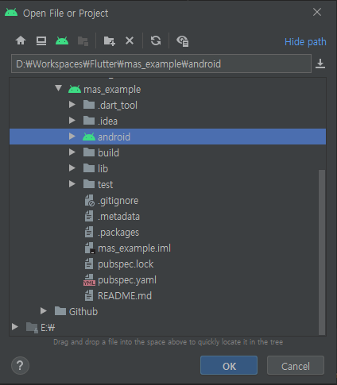

# YODO1 MAS 예제 프로젝트(Flutter)
## 예제 테스트 환경
CPU: AMD Ryzen 7 3800X  
RAM: 32GB  
GPU: RTX 3060 Ti 
FLUTTER: 2.0.5  
MAS: 4.0.5  
ANDROID STUDIO: 4.1.3  
MOBILE: SAMSUNG GALAXY S10+  

## 예제 실행 화면

## 주의사항
이 예제는 어디까지나 MAS를 사용하는 예시로서 만들어졌습니다.  
실제로 Flutter로 앱을 출시하기 위해서는 더 많은 부분들을 고려해야 합니다.  

구글에서 Flutter의 안드로이드 기본 생성 언어를 kotlin으로 하고 있습니다.
따라서 이 예제도 Kotlin 언어로 진행됩니다.

## 예제 실행방법
### 새로운 Flutter 프로젝트 생성
> flutter new mas-example

### MAS Android 연동 과정을 진행합니다.
안드로이드 스튜디오에서는 Flutter 프로젝트와 Kotlin 프로젝트를 따로 관리합니다.  
Flutter 프로젝트를 만들면 내부에 iOS와 web이 모두 있는 게 그 이유죠.  
따라서 MAS Android 연동 과정을 진행 할 때에는 [File] - [Open]으로 안드로이드 프로젝트를 열어서 진행하는 것이 좋습니다.  



이제 [MAS 연동 문서](https://support.yodo1.com/hc/en-us/articles/1500002038322)를 따라 진행합니다.

### main.dart 코드 수정
코드의 구조는 대단히 단순합니다.  
Flutter는 MethodChannel을 통해서 Kotlin에서 구현된 메서드를 호출 할 수 있습니다.  
버튼 4개를 만들고 눌렀을 때 Kotlin 메서드를 호출합니다.
``` dart
import 'package:flutter/material.dart';
import 'package:flutter/services.dart';

void main() {
  runApp(MyApp());
}

class MyApp extends StatelessWidget {
  @override
  Widget build(BuildContext context) {
    return MaterialApp(
      title: 'Flutter Demo',
      theme: ThemeData(
        primarySwatch: Colors.blue,
      ),
      home: SamplePage(),
    );
  }
}

class SamplePage extends StatefulWidget {
  SamplePage() : super();

  @override
  _SamplePageState createState() => _SamplePageState();
}

class _SamplePageState extends State<SamplePage> {
  static const platform = const MethodChannel('com.sample.mas');

  @override
  Widget build(BuildContext context) {
    return Scaffold(
      appBar: AppBar(
        title: Text("MAS FLUTTER SAMPLE"),
      ),
      body: Center(
        child: Column(
          mainAxisAlignment: MainAxisAlignment.center,
          children: <Widget>[
            ElevatedButton(
              onPressed: () {
                platform.invokeMethod('showBannerAd');
              },
              child: Text("Show Banner"),
            ),
            ElevatedButton(
              onPressed: () {
                platform.invokeMethod('dismissBannerAd');
              },
              child: Text("Hide Banner"),
            ),
            ElevatedButton(
              onPressed: () {
                platform.invokeMethod('showInterstitialAd');
              },
              child: Text("Show Interstitial"),
            ),
            ElevatedButton(
              onPressed: () {
                platform.invokeMethod('showRewardedAd');
              },
              child: Text("Show Rewarded"),
            ),
          ],
        ),
      ),
    );
  }
}

```

### MainActiviy.kt 수정
MainActivity.kt를 수정합니다.  
길어보이지만 실제로는 아주 간단한 코드입니다.  
Flutter를 위해서 MethodChannel을 등록하고 경우에 따라 호출 하는게 전부입니다.
``` kotlin
package com.example.mas_example

import android.app.Activity
import android.os.Bundle
import com.yodo1.mas.Yodo1Mas
import com.yodo1.mas.Yodo1Mas.*
import com.yodo1.mas.error.Yodo1MasError
import com.yodo1.mas.event.Yodo1MasAdEvent
import io.flutter.embedding.android.FlutterActivity
import io.flutter.embedding.engine.FlutterEngine
import io.flutter.plugin.common.MethodChannel
import io.flutter.plugins.GeneratedPluginRegistrant


class MainActivity: FlutterActivity() {
    private var CHANNEL:String = "com.sample.mas"

    override fun onCreate(savedInstanceState: Bundle?) {
        super.onCreate(savedInstanceState)

        ////////////////////////////////////////////////////////////////
        // YODO1MAS INITIALIZE
        ////////////////////////////////////////////////////////////////
        Yodo1Mas.getInstance().init(this, "qc2CstjcG5p", object : Yodo1Mas.InitListener {
            override fun onMasInitSuccessful() {
                /* BANNER */
                Yodo1Mas.getInstance().setBannerListener(object : Yodo1Mas.BannerListener() {
                    override fun onAdOpened(event: Yodo1MasAdEvent) {}
                    override fun onAdError(event: Yodo1MasAdEvent, error: Yodo1MasError) {}
                    override fun onAdClosed(event: Yodo1MasAdEvent) {}
                })
                /* INTERSTITIAL */
                Yodo1Mas.getInstance().setInterstitialListener(object : Yodo1Mas.InterstitialListener() {
                    override fun onAdOpened(event: Yodo1MasAdEvent) {}
                    override fun onAdError(event: Yodo1MasAdEvent, error: Yodo1MasError) {}
                    override fun onAdClosed(event: Yodo1MasAdEvent) {}
                })
                /* REWARDED */
                Yodo1Mas.getInstance().setRewardListener(object : RewardListener() {
                    override fun onAdOpened(event: Yodo1MasAdEvent) {}
                    override fun onAdvertRewardEarned(event: Yodo1MasAdEvent) {}
                    override fun onAdError(event: Yodo1MasAdEvent, error: Yodo1MasError) {}
                    override fun onAdClosed(event: Yodo1MasAdEvent) {}
                })

            }

            override fun onMasInitFailed(error: Yodo1MasError) {}
        })

        ////////////////////////////////////////////////////////////////
        // YODO1MAS METHODS FOR USING IN FLUTTER
        ////////////////////////////////////////////////////////////////

        /* LOAD */
        fun isRewardAdLoaded():Boolean
        {
            return Yodo1Mas.getInstance().isRewardedAdLoaded;
        }

        fun isInterstitialAdLoaded():Boolean
        {
            return Yodo1Mas.getInstance().isInterstitialAdLoaded;
        }

        fun isBannerAdLoaded():Boolean
        {
            return Yodo1Mas.getInstance().isBannerAdLoaded;
        }

        /* SHOW */
        fun showRewardedAd()
        {
            (context as Activity).runOnUiThread { Yodo1Mas.getInstance().showRewardedAd((context as Activity)) }
        }

        fun showInterstitialAd()
        {
            (context as Activity).runOnUiThread { Yodo1Mas.getInstance().showInterstitialAd((context as Activity)) }
        }

        fun showBannerAd(align: Int, offsetX: Int, offsetY: Int)
        {
            (context as Activity).runOnUiThread { Yodo1Mas.getInstance().showBannerAd((context as Activity), align, offsetX, offsetY) }
        }

        /* DISMISS */
        fun dismissBannerAd()
        {
            (context as Activity).runOnUiThread { Yodo1Mas.getInstance().dismissBannerAd() }
        }

        ////////////////////////////////////////////////////////////////
        // FLUTTER CHANNEL
        ////////////////////////////////////////////////////////////////
        GeneratedPluginRegistrant.registerWith(FlutterEngine(this))
        MethodChannel(flutterEngine?.dartExecutor?.binaryMessenger, CHANNEL).setMethodCallHandler { call, result ->
            when{
                call.method.equals("isRewardAdLoaded") -> { result.success(isRewardAdLoaded()) }
                call.method.equals("isInterstitialAdLoaded") -> { result.success(isInterstitialAdLoaded()) }
                call.method.equals("isBannerAdLoaded") -> { result.success(isBannerAdLoaded()) }
                call.method.equals("showRewardedAd") -> { result.success(showRewardedAd()) }
                call.method.equals("showInterstitialAd") -> { result.success(showInterstitialAd()) }
                call.method.equals("showBannerAd") -> { result.success(showBannerAd(48,0,0)) }
                call.method.equals("dismissBannerAd") -> { result.success(dismissBannerAd()) }

            }
        }
    }
}

```
여기서 눈 여겨 볼 것은 FLUTTER CHANNEL 입니다.  
``` Kotlin
////////////////////////////////////////////////////////////////
// FLUTTER CHANNEL
////////////////////////////////////////////////////////////////
GeneratedPluginRegistrant.registerWith(FlutterEngine(this))
MethodChannel(flutterEngine?.dartExecutor?.binaryMessenger, CHANNEL).setMethodCallHandler { call, result ->
    when{
        call.method.equals("isRewardAdLoaded") -> { result.success(isRewardAdLoaded()) }
        call.method.equals("isInterstitialAdLoaded") -> { result.success(isInterstitialAdLoaded()) }
        call.method.equals("isBannerAdLoaded") -> { result.success(isBannerAdLoaded()) }
        call.method.equals("showRewardedAd") -> { result.success(showRewardedAd()) }
        call.method.equals("showInterstitialAd") -> { result.success(showInterstitialAd()) }
        call.method.equals("showBannerAd") -> { result.success(showBannerAd(48,0,0)) }
        call.method.equals("dismissBannerAd") -> { result.success(dismissBannerAd()) }

    }
}
```
지금 현재 Flutter를 받아와서 이 우리가 지정한 CHANNEL을 등록합니다.
그리고는 경우에 따라서 호출하면 끝입니다.
> call.method.equals("METHOD_NAME") -> { result.success(METHOD()) }

### 마무리
놀랍게도 이게 전부입니다. :)  
단순히 Kotlin 함수를 호출할 수만 있으면 되었기 때문입니다.